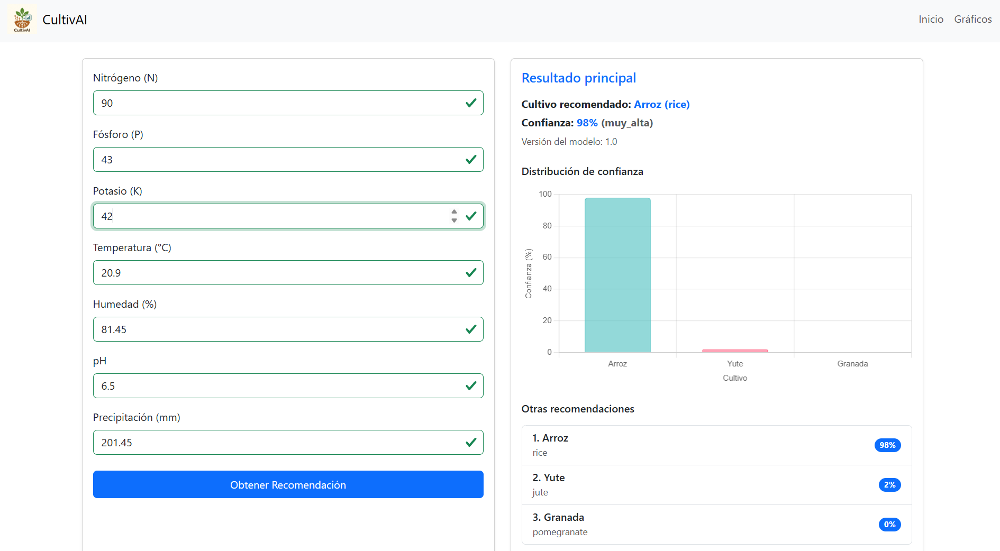
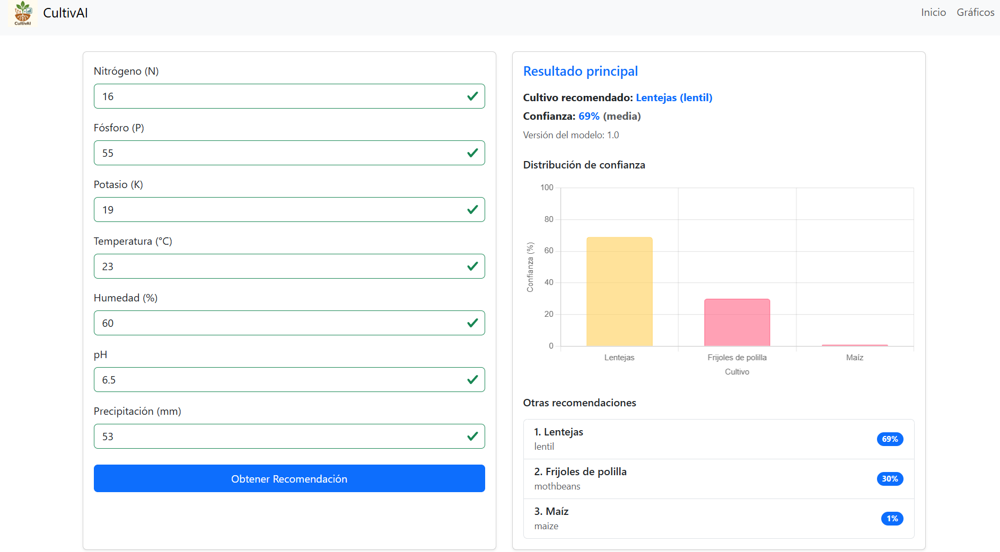

# 🌱 CultivAI
<p>Aplicación web de machine learning que sirve para la recomendación de cultivos agrícolas</p>
<div align="center">
    
</div>

<br>

## 📌 Características
- Modelo de clasificación entrenado con Random Forest utilizando un conjunto de datos agrícola.
- Predicción basada en parámetros como niveles de nitrógeno (N), fósforo (P), potasio (K), temperatura, humedad, pH y precipitación.

## 🚀 Instalación

1. Clona el repositorio:
```bash
git clone https://github.com/brianrscode/cultivai.git
cd cultivai
```
2. Crea un entorno virtual
```bash
python -m venv venv
```

3. Activa el entorno virtual
    - En Windows:

    ```bash
    venv\Scripts\activate
    ```

    - En macOS y Linux:

    ```bash
    source venv/bin/activate
    ```

4. Instala las dependencias:
```bash
pip install -r requirements.txt
```

5. Ejecuta el servidor de desarrollo:
```bash
python manage.py runserver
```

## 🧪 Cómo usar CultivAI
- Ingresa los valores de N, P, K, temperatura, humedad, pH, y precipitación.
- El modelo procesará los datos y devolverá el cultivo más adecuado.
- Visualiza el resultado directamente en la página web.

## 📷 ScreenShots
<table>
    <tr>
        <td>
            
        </td>
        <td>
            
        </td>
    </tr>
</table>

## 📊 Dataset

Fuente: [Kaggle - Crop Recommendation Dataset](https://www.kaggle.com/datasets/atharvaingle/crop-recommendation-dataset/data)